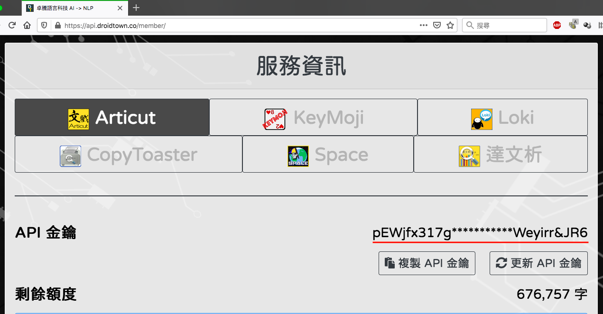
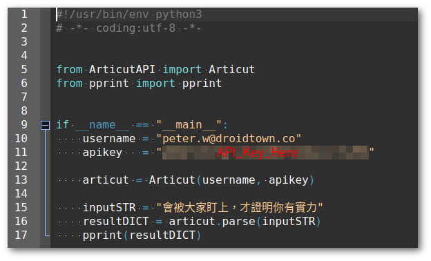
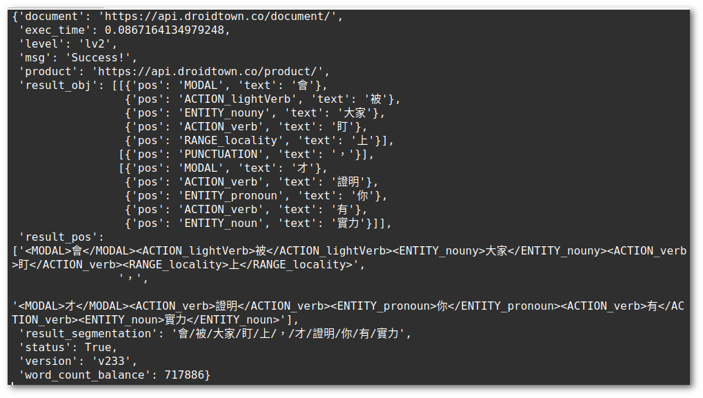
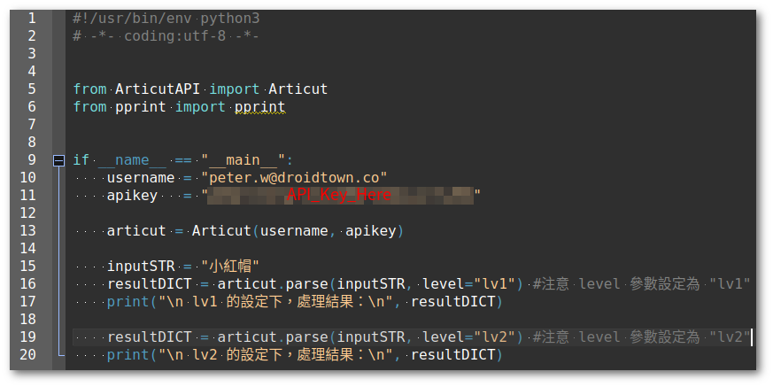
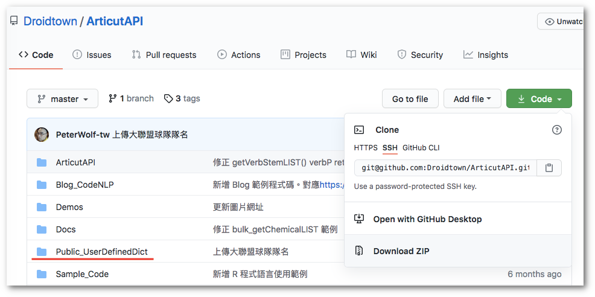
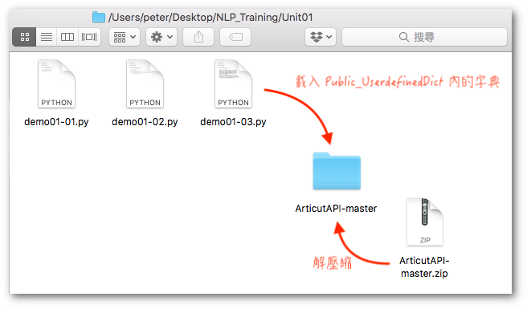
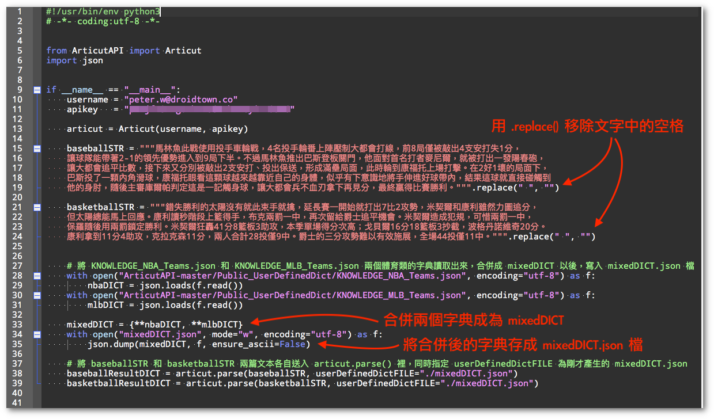

# Week01 ArticutAPI 套件介紹

### 前言
Articut 是一套「純台灣製造」的中文 NLP 系統。它能同時處理中文斷詞、詞性標記以及命名實體標記的套件。相較於 Jieba 分詞、Stanford CoreNLP 以及中研院的 CKIP 或是其它基於簡體字的語料訓練出來的 HanLP、哈工大LTP…等等方案，Articut 具有功能完備、應用靈活及對新詞的接受度高且更新迅速的特點。

Articut 需在 Python3.6 以上的環境中運作！

### 安裝 ArticutAPI
ArticutAPI 則是可透過 Python 的套件系統進行安裝並操作 Articut的 API 介面。只要在電腦裡下指令：

```bash
pip3 install ArticutAPI
```

或

```bash
python3 -m pip install ArticutAPI
```

即可完成安裝。

### 註冊並取得教學用 API 金鑰

卓騰語言科技免費提供一個月無字數限制之 Articut 教學用金鑰給中華民國教育部承認之教學單位授課使用。請先至 [https://api.droidtown.co](https://api.droidtown.co/) 完成註冊，並來信 [info@droidtown.co](mailto:info@droidtown.co) 載明：

1. 授課教師姓名
2. 授課教師 email (必需和前述註冊帳號一致)
3. 授課大綱

經查証後，即可取得「一個月」無字數限制之 Articut 教學用金鑰。 再登入 [https://api.droidtown.co](https://api.droidtown.co/)後，即能在以下畫面取得 Articut NLP 系統的操作金鑰：
 
  

點擊 \[複製 API 金鑰\] 鈕，即可取得金鑰。

### **基本操作**範例如下：(請將 username 更換為您的 Articut 帳號Email)



回傳結果如下：



### 進階用法之一：lv1 和 lv2

Articut Level斷詞的深度。數字愈小，切得愈細。比如說「小紅帽」在 lv1 的設定下，將會回傳為「小/紅/帽」。但在 lv2 的設定下，則會回傳「小紅帽」 (預設值為 lv2)。



執行結果如下：


比較 lv1 和 lv2 的結果，可發現在 lv1 中切的極細的「**小** / **紅** / **帽**」，在 lv2 中被結合成「**小紅帽**」一個詞彙。

  

同理，在 lv1 下會把動詞和時態標記分開，因此「創造了」會被切分成「創造/了」；但在 lv2 的設定下，則會把動詞和時態標記結合在一起，因此「創造了」將在 lv2 處理為「創造了」。

  

這是因為 Articut 將時態標記「了」視為像是英文裡的 -ed。因此，在 lv1 時，採取將之處理為 "create/-ed" 分開的兩個元素，但在 lv2 的設定下，則是以 "created" 這種「詞 \+ 時態標記」的形式輸出。

  

### 進階用法之二：載入自訂字典

處理不同領域的文本時，我們可以載入相應的領域字典以便增加處理結果的正確率。以下示範載入MLB 和 NBA 兩種字典來處理棒球和籃球的語料結果。

字典檔的存放位置在 ArticutAPI 的 Github.com 專案內，網址是：

[https://github.com/Droidtown/ArticutAPI](https://github.com/Droidtown/ArticutAPI)

 
  

點擊畫面右方的 \[Code\] 找到 \[Download ZIP\] 的選項，下載壓縮檔，然後將它解壓縮後，放在 demo01-03.py 的旁邊備用。
 


由於稍後我們要示範的語料是「體育運動」類的，而剛好在ArticutAPI-master 的 Public_UserdefinedDict 內有幾個球隊名稱的領域字典可以使用。我們將這幾個領域字典讀取出來，並結合成單一一個字典檔，和要處理的文本一起傳給 Articut 以便增加結果的正確性。

棒球語料：

>本週三在紐約的比賽中，馬林魚此戰使用投手車輪戰，4名投手輪番上陣壓制大都會打線，前8局僅被敲出4支安打失1分，讓球隊能帶著2-1的領先優勢進入到9局下半。不過馬林魚推出巴斯登板關門，他面對首名打者麥尼爾，就被打出一發陽春砲，讓大都會追平比數，接下來又分別被敲出2支安打、投出保送，形成滿壘局面，此時輪到康福托上場打擊。在2好1壞的局面下，巴斯投了一顆內角滑球，康福托眼看這顆球越來越靠近自己的身體，似乎有下意識地將手伸進好球帶內，結果這球就直接碰觸到他的身肘，隨後主審庫爾帕判定這是一記觸身球，讓大都會兵不血刃拿下再見分，最終贏得比賽勝利。

  

籃球語料：

>昨晚的紐約西區霸王之戰中，錯失勝利的太陽沒有就此束手就擒，延長賽一開始就打出7比2攻勢，米契爾和康利雖然力圖追分，但太陽總能馬上回應。康利讀秒階段上籃得手，布克兩罰一中，再次留給爵士追平機會。米契爾造成犯規，可惜兩罰一中，保羅隨後用兩罰鎖定勝利。米契爾狂轟41分8籃板3助攻，本季單場得分次高；戈貝爾16分18籃板3抄截，波格丹諾維奇20分。康利拿到11分4助攻，克拉克森11分，兩人合計28投僅9中。爵士的三分攻勢難以有效施展，全場44投僅11中。

 