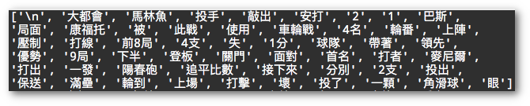
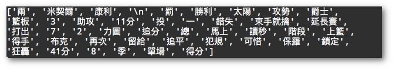
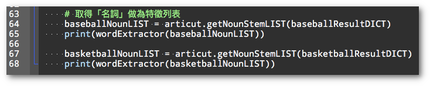
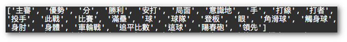
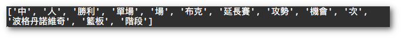
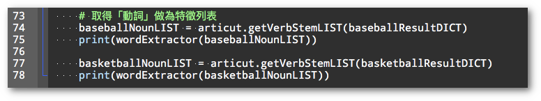
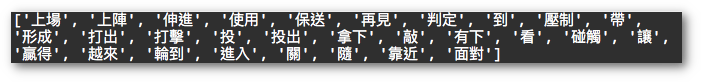
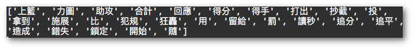

## Week02 文本分析任務：

文本分析是常見的 NLP 任務。本節將示範三種常見的手法，一是取 TF-IDF 特徵詞、二是依詞性取特徵詞、三是依「人、事、時、地、物」取特徵詞。特徵詞可以做為代表文本內容的一種參考維度。

### TF-IDF 文本比較 (沒有利用 POS 資訊時的文本分析)

延續 Unit01 中棒球和籃球的例子，我們使用 **Articut** 內建的 **analyse** 工具包裡的 **extract_tags()** 函式來計算 **TF-IDF**。

棒球語料的 TF-IDF 存在 baseball_TFIDF 裡，印出後內容如下：

籃球語料的 TF-IDF 存在 baseball_TFIDF 裡，印出後內容如下：

從兩篇文章的 TF-IDF 特徵詞裡，如果沒有相關的背景知識知道「大都會」、「馬林魚」是棒球大聯盟的球隊，而「爵士」是 NBA 的球隊名稱的話，其實很難確認究竟哪些詞彙是可以做為「棒球類」或是「籃球類」的文本分類特徵詞。

但我們可以確認的是「`投手`」、「`安打`」、「`打線`」這三個**名詞**，應該是只有棒球類的文本才會用到。而「`籃板`」這個**名詞**，則是籃球類的文本才會用到。同理，我們也能觀察到「`敲出`」、「`保送`」、「`打擊`」這幾個**動詞**同時出現的文章，有很大的機率是在描寫棒球類的文本。而「`助攻`」、「`上籃`」則常見於描寫籃球比賽過程的**動詞**。

這個觀察最重要的是讓我們發現「詞性」(前文提到的「名詞」、「動詞」) 是可以做為抽取特徵詞的一種方法。接下來，我們利用 Articut 的詞性篩選工具來取出「**名詞**」和「**動詞**」。

### 抽詞任務一：名詞比較 (利用 POS 資訊時)

延續前例，我們使用 **Articut** 內建的 **.getNounStemLIST()** 函式來取得文本中各句的**名詞**。

棒球報導文本的名詞

籃球報導文本的名詞：

從名詞裡看出來，有些詞彙 (例如「勝利」) 是重覆的，要得到更好的效果的話，還可以把重覆的詞彙去除以便讓不同的類別都具有各自獨立的特徵詞表。

### 抽詞任務二：動詞比較 (利用 POS 資訊時)

延續前例，我們使用 **Articut** 內建的 **.getVerbStemLIST()** 函式來取得文本中各句的動**詞**。

棒球報導文本的「動詞」

籃球報導文本的動詞：

  

從動詞裡看出來，有些詞彙 (例如「打出」、「投」、「隨」) 是重覆的，要得到更好的效果的話，還可以把重覆的詞彙去除以便讓不同的類別都具有各自獨立的特徵詞表。
