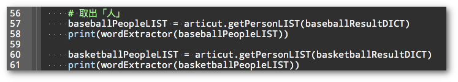
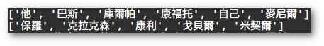
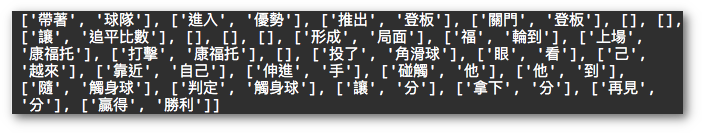
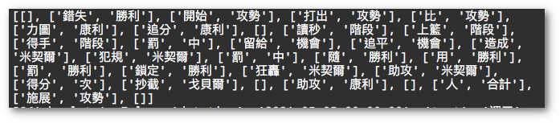
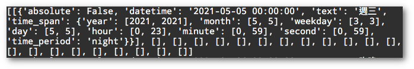
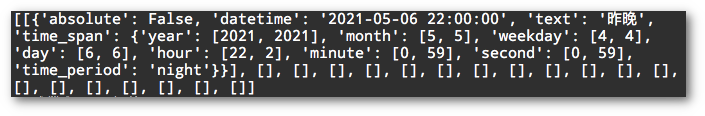
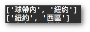

## Week03: 抽詞

如前一週所述，文本可依「人、事、時、地、物」取特徵詞。特徵詞可以做為代表文本內容的一種參考維度。也就是說，當我們在做文本分類的時候，可以依這五個維度把文章進行分類。

如果有多篇文章中提及的「人」有大量的重覆，那麼我們大概可以推測它大概是在討論類似的主題。同樣的道理，同樣的「事、時、地、物」也可以做為分類文本時的依據。

比較需要理解的是「事」在這裡指的是「事件」。一個「事件」由「涉及的人/物」加上「動作」構成。稍後我們看到更多的例子應該會更好理解。

以下搭配程式碼，依序說明：

### 從文本中抽取其意義指「人」的詞彙

    

輸出的結果如下

    

其中 **\['他', '巴斯', '庫爾帕'...\]** 這些就是**棒球比賽**的文本中出現的人名。而 **\['保羅', "克拉克森', '康利'...\]** 則是**籃球比賽**的文本中出現的人名。

### 從文本中抽取其意義指「事件」的詞彙組

Articut 除了 lv1 和 lv2 以外，另外有一個 lv3 的「語意分析」能力。操作的方式和之前操作 lv1/lv2 一樣，透過 **.parse()** 的函式，同時傳入 mixedDICT.json 的字典檔。最大的不同是之前設為 "**lv1**" 或 "**lv2**" 的 level 參數，這次設定為 "**lv3**"。並將最後計算後的結果取出 **\["event"\]** 的值。

從棒球比賽的文本裡可以看到的是有「帶著 \- 球隊」、「進入 \- 優勢」…等等的事件發生。甚至可以看到最後是「贏得 \- 勝利」而可以推測該句的主角在最後應該是贏了比賽。

從籃球比賽的文本裡，

則可以看到「**錯失\-勝利**」、「**狂轟\-米契爾**」、「**助攻\-米契爾**」…等等事件。

### **從文本中抽取其意義指「時間」的詞彙組**

「時間」資訊也是屬於 lv3 語意分析的範疇，因此操作上和前述的「事件」一樣，只在最後取出的是 **\["time"\]** 而不是 **\["event"\]** 而已。

  

在原文「**本週三在紐約的比賽…**」裡，「**週三**」就是一個表示時間的詞彙。Articut 的lv3 在計算時間時，可自行決定要不要參考當下的時間。由於本範例是在 2021.05.06 (四) 執行的，參考這個時間的結果，Articut 將「**週三**」計算為 "2021-05-05" 這天。

  

另一篇籃球比賽的文本裡，則「**昨晚的紐約西區霸王之戰中…**」中，有「**昨晚**」這一個表示時間的詞彙。Articut lv3 的 **\["time"\]** 則算出以下的結果。一樣取出了「**昨晚**」並加以計算出它的時間在 "2021-05-06"。

  

### **從文本中抽取其意義指「地點」的詞彙組**

Articut 自帶的 **.getLocationStemLIST()** 函式可以像前述取得人名列表一樣地操作，將文本中指涉「某種地方」或「位置」的詞彙抽出。

  

兩篇文本各自取出的地點/位置詞彙如下：

  
  

  
  

### **從文本中抽取其意義指「物品」的詞彙組**

這個功能其實和前一週提到的「抽出名詞」是一樣的。這裡就只做擷圖呈現，不再多做冗述。

棒球報導文本的名詞

籃球報導文本的名詞：

