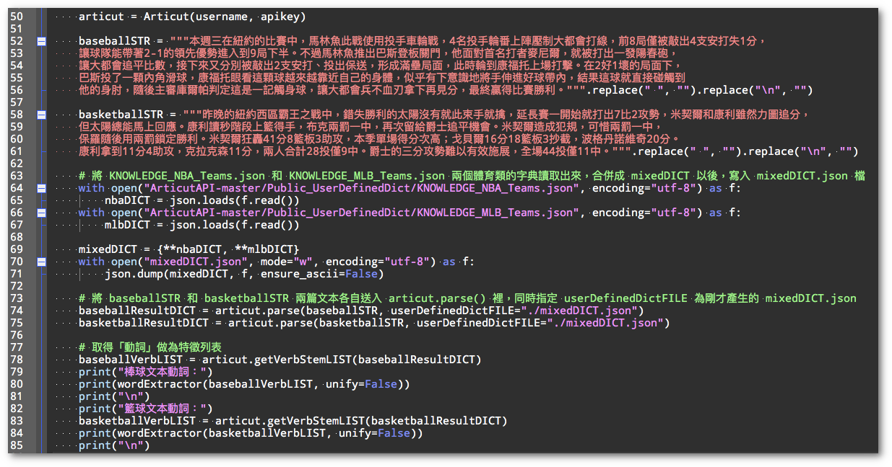
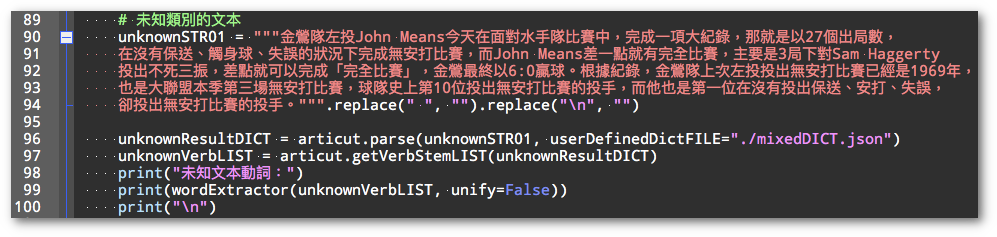
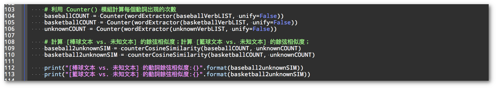
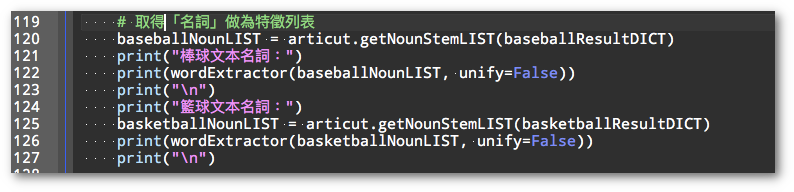
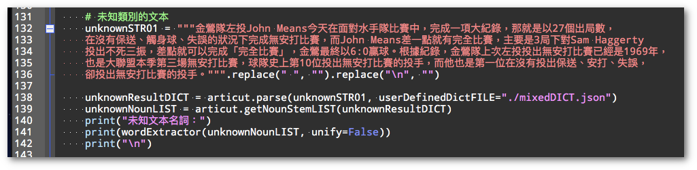
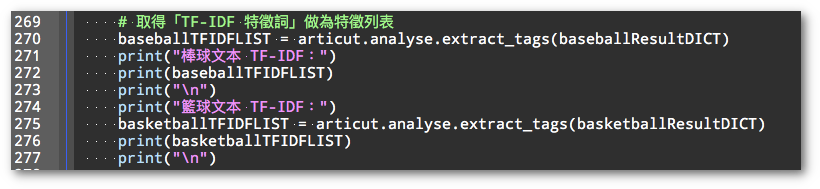
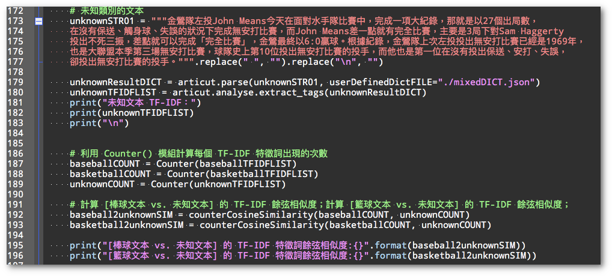
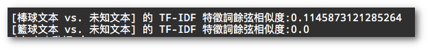

## **Week04: 實作**

**球類競賽報導新聞分類**

前幾週的教學活動中，已經練習過如何藉由抽出特徵詞來做為分類依據。接下來將示範利用這些詞彙來分類的實例。

假設我們有一組需要分類為「棒球」或是「籃球」的文本如下：

某待分類的文本：

**金鶯隊左投 John Means 今天在面對水手隊比賽中，完成一項大紀錄，那就是以 27 個出局數，在沒有保送、觸身球、失誤的狀況下完成無安打比賽，而 John Means 差一點就有完全比賽，主要是 3 局下對 Sam Haggerty 投出不死三振，差點就可以完成「完全比賽」，金鶯最終以 6:0 贏球。根據紀錄，金鶯隊上次左投投出無安打比賽已經是 1969 年，也是大聯盟本季第三場無安打比賽，球隊史上第 10 位投出無安打比賽的投手，而他也是第一位在沒有投出保送、安打、失誤，卻投出無安打比賽的投手。**

我們可以透過計算文本中動詞的餘弦相似性，來看看它比較像哪一種文章。

首先，我們利用Week01 時做過的步驟，取出兩篇做為比較基準的「棒球類文本」和「籃球類文本」中的「**動詞列表**」。

  

接著，我們將一篇「不知其類別」的文本，也用一樣的步驟取出它的「**動詞列表**」。

  

接下來，利用 **Counter()** 模組將列表中的每個動詞出現的次數，各自累加起來。再用 **counterCosinSimilarity()** 函式計算 \[**棒球類文本 vs. 未知文本**」的餘弦相似度，以及 \[**籃球類文本 vs. 未知文本**\] 的餘弦相似度。

  

得到的值如下：

  

這表示 **\[棒球文本\]** 和 **\[未知文本\]** 之間的相似度，比 **\[籃球文本\]** 和 **\[未知文本\]** 之間的相似度來得高。

因為我們是使用「動詞」來計算的，因此我們可以將這次的分類結果解釋為：「未知文本中，描述發生什麼事件使用的動詞，和棒球文本相比，較為相似。」

同樣的步驟，除了在「動詞」上操作以外，我們也能在「名詞」上依樣畫葫蘆。首先取出做為基準文本的「棒球類文本」和「籃球類文本」的「名詞列表」：

接著用一樣的方法取出「未知文本」的名詞列表：

一樣利用 **Counter()** 模組將列表中的每個名詞出現的次數，各自累加起來。再用 **counterCosinSimilarity()** 函式計算 \[**棒球類文本 vs. 未知文本**」的名詞餘弦相似度，以及 \[**籃球類文本 vs. 未知文本**\] 的名詞餘弦相似度。結果如下：

同樣地也顯示出 **\[棒球文本\]** 和 **\[未知文本\]** 之間的相似度，比 **\[籃球文本\]** 和 **\[未知文本\]** 之間的相似度來得高。

因為這次是使用「名詞」來計算的，因此我們可以將這次的分類結果解釋為：「未知文本中，涉及的物體或人物，和棒球文本相比，較為相似。」

以上的實作中，顯示出兩個特點：

1. 利用詞性 (動詞/名詞) 做出的抽詞技術，我們可以用很少量的資料就做出文本分類模型。
2. 因為詞性有其解釋性，我們知道「動詞」代表著涉及的事件、「名詞」代表著事件中的物體或人物。因此我們做出來的結果也具有解釋性。

相對地，如果我們使用 TF-IDF 特徵字的方式來進行前述的操作的話，第一個步驟一樣是利用 extract_tags() 的函式，取出 \[棒球類文本\] 和 \[籃球類文本\] 各自的 TF-IDF 的特徵詞列表：

接著也取出 \[未知文本\] 的 TF-IDF 特徵詞列表，並以 Counter() 計算每個特徵詞的出現次數以後，透過 **counterCosinSimilarity()** 來計算文本之間的相似度。

結果如下：

由結果可見，利用 TF-IDF 來做分類，一樣有效果。但是如果要解釋究竟「未知文本」和「棒球文本」之間「什麼東西很相似？」我們只能說「文本特徵很像」，而無法像前面的例子中所說明的「它們描述的事件很像」或是「它們涉及的物體/人名」很相似。

簡單地說，利用 TF-IDF 做文本分類時，分類器的解釋力是大大地降低的。

同樣的步驟，在 Github 專案的 Unit04 的原始碼中，我們換一個新的未知文本來測試。也可以看出同樣具有分類效力的結果。