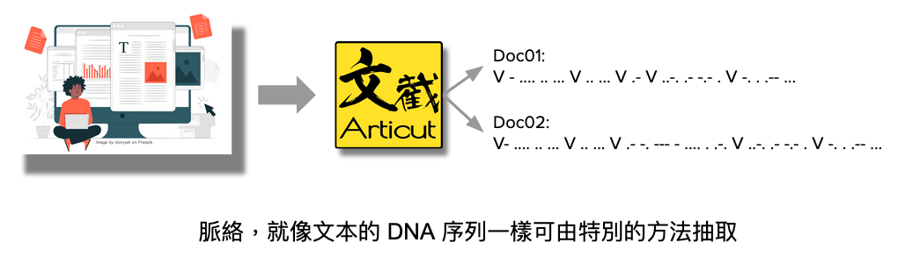
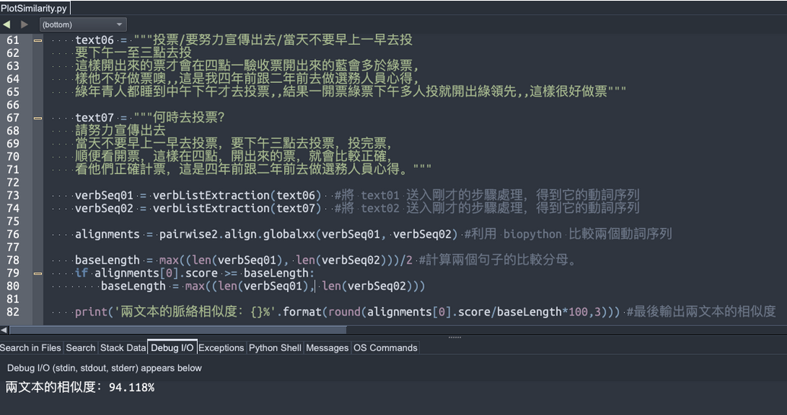

## **Unit05: 實作**

**文本脈絡相似度分析**

如果兩篇故事型的文本 (即內容行文順序與時間順序相關) 是在講述同一事件，那麼這兩篇文本的脈絡應該會很像。畢竟，如果連脈絡都不像，那麼兩篇文章就算都使用一樣的詞彙，也是在講不同的事情。

透過 Articut，我們將有能力計算「脈絡」！

概念說明：

如上圖所述，我們先將文本透過 Articut 的 .getVerbStemLIST() 工具，抽出其中的動詞以後，再將這些動詞視為 DNA 序列的內容。

接著，再利用 BioPython 模組中的 pairwise2 產生兩組序列的比較結果。最後，為避免脈絡相似度的計算結果數字過小而無法計算，先假設兩組序列`較大那組序列的一半長度`做底數，試試看能否將相似度投射到 0~1 之間以便計算相似度的百分比。若這一半會小於比較結果的 score，表示投射後會大於 1，此時便只取`較大的那組序列的完整長度`做底數來計算相似度。

