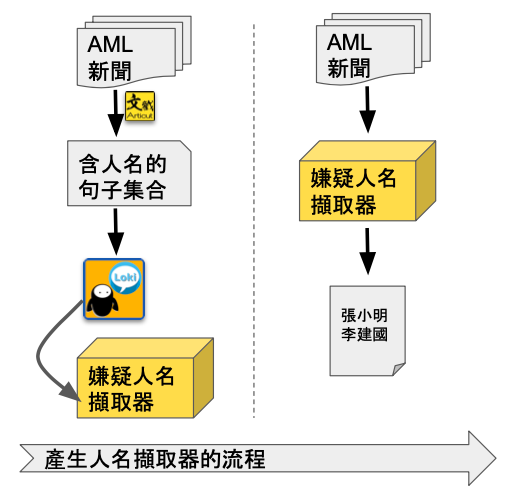

## **Unit05: 實作：進階抽詞任務**


在新聞報導的文本裡，有許多違法犯罪事件的新聞。其中，涉及諸如走私、廢棄物清理、政府採購法…等行為的犯罪人 ([參照：洗錢防制法 (AML)](https://law.moj.gov.tw/LawClass/LawAll.aspx?pcode=G0380131))，是會被列為需要特別注意的名單。

本單元的任務，就是設計並實作一個 NLP 模型，它可以產生的「特別注意名單」。

**語料說明：**

Corpus 中含有兩批資料，分別存放於 AML_News 和 Other_News 中。其中 AML_News 是「涉及違反洗錢防制法」的新聞，而 Other_News 則是「不涉及洗錢防制法」的新聞。

Test_News 中則是用來測試你的模型的新聞。裡面有一些是涉及違反洗錢防制法的新聞，有一些是不涉及洗錢防制法的新聞。

Gold.json 則是標準答案。 

```
├── AML_News.json
├── Other_News.json
├── Test_News.json
└── Gold.json
```

**施作流程**

首先依「分類模型」進行文本分類，偵測該篇新聞「是否屬於 AML 新聞」；接著再依「抽詞模型」進行「人名抽取」。

- 分類模型的產生與應用：


    - 說明：
        - 犯罪事實多半與「做了某件違法」的事而成立，因此**違反 AML** 的新聞文本以及**沒有違反 AML**的新聞文本中的動詞應該是不一樣的。
        - 故設計方向是先取出**違反 AML** 的新聞中的動詞做為 A 集合，再取出**沒有違反 AML** 的新聞中的動詞做為 B 集合。再將 A 集合減去 B 集合做為純化。這個新的 C 集合，即為分類器。
        - 使用時，將新的未知文本中的動詞取出，做為 D 集合，並計算 D 集合和 C 集合的相似度。如果相似度高，則視為「該文本中描述的行為和**違反 AML** 的文本相似」；若相似度低，則視為「該文本中描述的行為和**違反 AML** 的文本不相似。」

  - 抽詞模型的產生與應用：

    - 說明：
        - 模型目標是要抽出人名，因此首先找出文本中所有「含有人名」的句子 K，再將這些句子都建入 Loki NLU 系統中。
        - 在 Loki NLU 系統中將所有可勾選的詞彙元素都勾選，使其成為變數以最大化該訓練句的泛化能力。
        - 在 Loki NLU 系統中將所有近義的動詞加以勾選，使其最大化該訓練句的泛化能力。
        - 產生抽詞模型、部署該模型並下載範例程式。

  - 系統操作：
    - 首先利用 [分類模型] 判定該文本是否屬於**違反 AML 新聞**，若是，則進入 [抽詞模型]，並透過 [抽詞模型] 將人名抽出並另存於 result.json 中；若否，則忽略該文本。

  - 結果評估：
      - 以 Gold.json 為標準，假設 Gold 中有 M 個人名，而 result.json 中找到 N 個和 Gold.json 重覆的人名，則記為將 N 除以 M 做為結果。若 N 中有出現「不在 Gold.json」中的人名，則每出現一個扣 0.02 * Gold.json 的總數。扣至 0 為止。